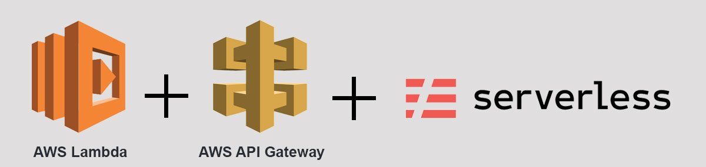

# Serverless Todo Application

> This project showcases a todo app that was built Serveless and AWS Lambda.




## Description

The project is split into two parts:
1. [The Simple Frontend](/client) A basic React client web application which consumes the Todo RestAPI Backend. 
2. [The RestAPI Todo Backend](/backend), a Serverless powered Todo RestAPI Backend.

## Getting Setup

> _tip_: this frontend is designed to work with the RestAPI backends). It is recommended you stand up the backend first, test using Postman, and then the frontend should integrate.

### Installing Node and NPM
This project depends on Nodejs and Node Package Manager (NPM). Before continuing, you must download and install Node (NPM is included) from [https://nodejs.com/en/download](https://nodejs.org/en/download/).

### Installing Serverless Cli
The Serverless Command Line Interface is required to develop, deploy, troubleshoot and secure your serverless application. Instructions for installing the CLI can be found in the [Serverless Framework Documentation](https://www.serverless.com/framework/docs/).

Run `npm i -g serverless` to download and install all the Serverless Framework dependencies.

Configure your aws credentials into serverless using the command `sls config credentials --provider aws --key YOUR_ACCESS_KEY --secret YOUR_SECRET_KEY --profile serverless`

### Installing project dependencies

This project uses NPM to manage software dependencies. NPM Relies on the package.json file located in the root of this repository. After cloning, open your terminal and run:
```bash
npm install
```
>_tip_: **npm i** is shorthand for **npm install**

### Backend setup

* Open a new terminal within the _backend_ directory and run:
* Install project dependencies with `npm i`
* Run `sls deploy -v` to upload the code to your aws account

### Client setup

* Open a new terminal within the _client_ directory and run:
* Install project dependencies with `npm i`
* Start the development server with `npm start`
* Open the browser at `localhost:3000`

### Postman

Import the `collection-postman.json` file into your Postman app to import all the requests.

## Built With

* [React](https://reactjs.org/) - The web framework used
* [Javascript](https://en.wikipedia.org/wiki/JavaScript) - The programming language used
* [Node.js®](https://nodejs.org/) - The JavaScript runtime used
* [AWS API Gateway](https://aws.amazon.com/api-gateway/) - AWS managed service used to create, publish, maintain, monitor, and secure APIs
* [AWS Lambda](https://aws.amazon.com/lambda/) - AWS managed service used to run code without provisioning or managing servers
* [Serverless](https://www.serverless.com/) - The framework used to develop, deploy, monitor and secure serverless applications on the cloud

## Authors

* **[Pemberai Sweto](https://github.com/thepembeweb)** - *Initial work* - [Serverless Todo Application](https://github.com/thepembeweb/serverless-todo-app)

## License

[](http://badges.mit-license.org)

- This project is licensed under the MIT License - see the [LICENSE.md](LICENSE.md) file for details
- Copyright 2020 © [Pemberai Sweto](https://github.com/thepembeweb).


